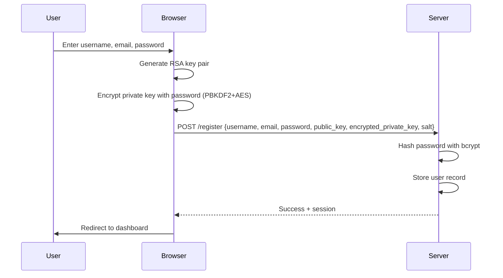
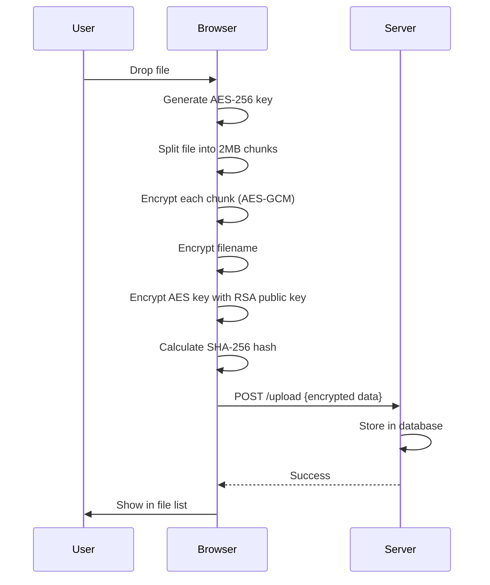
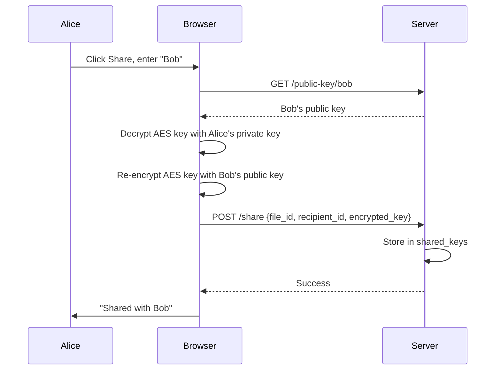

# SecureShare - Comprehensive Application Report

**Application Name:** SecureShare  
**Type:** End-to-End Encrypted (E2EE) File Sharing Platform  
**Architecture:** Zero-Knowledge, Client-Side Encryption  
**Generated:** January 16, 2026

---

## 1. Executive Summary

SecureShare is a web-based file sharing application that implements **zero-knowledge architecture** with **end-to-end encryption**. The server never has access to plaintext files, filenames, or encryption keys. All cryptographic operations occur in the user's browser using the Web Crypto API.

### Key Highlights

- 🔐 **AES-256-GCM** file encryption
- 🔑 **RSA-OAEP 4096-bit** key exchange
- 🌐 **Zero-knowledge** server design
- 👥 **Secure file sharing** with key re-encryption
- 🎨 **Dark/Light theme** support
- 📱 **Responsive design** for all devices

---

## 2. Technology Stack

### Frontend

| Technology | Purpose |
|------------|---------|
| HTML5 | Structure and semantic markup |
| CSS3 | Styling with CSS variables, Flexbox, Grid |
| Vanilla JavaScript | Application logic, no frameworks |
| Web Crypto API | Client-side cryptography |

### Backend

| Technology | Purpose |
|------------|---------|
| Python 3.x | Server language |
| Flask | Web framework |
| SQLite | Database with WAL mode |
| Flask-Talisman | Security headers (CSP, HSTS) |
| bcrypt | Password hashing |

### Security Libraries

| Library | Version | Purpose |
|---------|---------|---------|
| Flask-Talisman | Latest | HTTPS enforcement, CSP, HSTS |
| bcrypt | Latest | Secure password hashing |
| secrets | Built-in | Cryptographic random generation |

---

## 3. Architecture Overview

```
┌─────────────────────────────────────────────────────────────┐
│                      USER'S BROWSER                         │
│  ┌─────────────┐  ┌─────────────┐  ┌─────────────────────┐ │
│  │  crypto.js  │  │   auth.js   │  │      files.js       │ │
│  │ AES-256-GCM │  │ RSA-OAEP    │  │ Upload/Download     │ │
│  │ Key Gen     │  │ Key Mgmt    │  │ Encrypt/Decrypt     │ │
│  └─────────────┘  └─────────────┘  └─────────────────────┘ │
│         │                │                    │             │
│         └────────────────┴────────────────────┘             │
│                          │                                  │
│              ENCRYPTED DATA ONLY ↓↑                         │
└─────────────────────────────────────────────────────────────┘
                           │
                    HTTPS (TLS 1.3)
                           │
┌─────────────────────────────────────────────────────────────┐
│                     FLASK SERVER                            │
│  ┌─────────────┐  ┌─────────────┐  ┌─────────────────────┐ │
│  │  auth.py    │  │  files.py   │  │    sharing.py       │ │
│  │ User Mgmt   │  │ File Store  │  │ Access Control      │ │
│  └─────────────┘  └─────────────┘  └─────────────────────┘ │
│                          │                                  │
│                    ┌─────────────┐                          │
│                    │   SQLite    │                          │
│                    │ (Encrypted  │                          │
│                    │  Data Only) │                          │
│                    └─────────────┘                          │
└─────────────────────────────────────────────────────────────┘
```

---

## 4. Cryptographic Implementation

### 4.1 Algorithms Used

| Algorithm | Key Size | Purpose |
|-----------|----------|---------|
| RSA-OAEP | 4096-bit | Asymmetric key exchange |
| AES-GCM | 256-bit | Symmetric file encryption |
| SHA-256 | 256-bit | File integrity verification |
| PBKDF2 | 100,000 iterations | Password-based key derivation |

### 4.2 Key Generation

**RSA Key Pair (Per User)**

```javascript
{
  name: 'RSA-OAEP',
  modulusLength: 4096,
  publicExponent: [1, 0, 1],
  hash: 'SHA-256'
}
```

**AES Key (Per File)**

```javascript
{
  name: 'AES-GCM',
  length: 256
}
```

### 4.3 Encryption Flow

1. **File Upload:**
   - Generate random AES-256 key
   - Generate random IV (12 bytes)
   - Encrypt file in 2MB chunks with AES-GCM
   - Encrypt filename with same AES key
   - Encrypt AES key with user's RSA public key
   - Send all encrypted data to server

2. **File Download:**
   - Receive encrypted chunks from server
   - Decrypt AES key with user's RSA private key
   - Decrypt each chunk with AES-GCM
   - Verify SHA-256 hash integrity
   - Reconstruct and save file

### 4.4 Private Key Protection

```javascript
// Private key encrypted before server storage
Salt: 16 random bytes
Key Derivation: PBKDF2-SHA256 (100,000 iterations)
Encryption: AES-256-GCM with 12-byte IV
```

---

## 5. Database Schema

### 5.1 Tables

**users**

| Column | Type | Description |
|--------|------|-------------|
| id | INTEGER | Primary key, auto-increment |
| username | TEXT | Unique, lowercase |
| email | TEXT | Unique, for password reset |
| password_hash | TEXT | bcrypt hashed password |
| public_key | TEXT | Base64 RSA public key |
| encrypted_private_key | TEXT | Password-encrypted private key |
| key_salt | TEXT | Salt for key derivation |
| reset_token | TEXT | Password reset token |
| reset_token_expires | TIMESTAMP | Token expiration |
| created_at | TIMESTAMP | Account creation time |
| failed_attempts | INTEGER | Login failure counter |
| locked_until | TIMESTAMP | Account lockout time |

**files**

| Column | Type | Description |
|--------|------|-------------|
| id | INTEGER | Primary key |
| owner_id | INTEGER | FK to users |
| filename_encrypted | TEXT | AES-encrypted filename |
| original_size | INTEGER | Original file size in bytes |
| upload_date | TIMESTAMP | Upload timestamp |
| file_hash | TEXT | SHA-256 of original file |
| iv | TEXT | Initialization vector |
| encrypted_aes_key | TEXT | RSA-encrypted AES key |

**file_chunks**

| Column | Type | Description |
|--------|------|-------------|
| id | INTEGER | Primary key |
| file_id | INTEGER | FK to files |
| chunk_index | INTEGER | Chunk order (0-based) |
| chunk_data | TEXT | Base64 encrypted chunk |
| chunk_iv | TEXT | Per-chunk IV |

**shared_keys**

| Column | Type | Description |
|--------|------|-------------|
| id | INTEGER | Primary key |
| file_id | INTEGER | FK to files |
| sender_id | INTEGER | FK to users (sharer) |
| recipient_id | INTEGER | FK to users (recipient) |
| encrypted_aes_key | TEXT | Re-encrypted for recipient |
| shared_at | TIMESTAMP | Share timestamp |

**access_logs**

| Column | Type | Description |
|--------|------|-------------|
| id | INTEGER | Primary key |
| user_id | INTEGER | FK to users |
| action | TEXT | Action type |
| file_id | INTEGER | FK to files (optional) |
| timestamp | TIMESTAMP | Action time |
| ip_address | TEXT | Client IP |
| status | TEXT | success/error/denied |
| details | TEXT | Additional info |

---

## 6. API Endpoints

### 6.1 Authentication Routes (`/api/auth`)

| Method | Endpoint | Description |
|--------|----------|-------------|
| POST | `/register` | Create new account with email |
| POST | `/login` | Authenticate user |
| POST | `/logout` | End session |
| GET | `/check` | Verify session status |
| GET | `/public-key/<username>` | Get user's public key |
| GET | `/search?q=<query>` | Search users for sharing |
| POST | `/change-password` | Update password |
| POST | `/forgot-password` | Request reset token |
| POST | `/reset-password` | Reset with token |
| POST | `/delete-account` | Permanently delete account |

### 6.2 File Routes (`/api/files`)

| Method | Endpoint | Description |
|--------|----------|-------------|
| POST | `/upload` | Upload encrypted file |
| GET | `/list` | List owned and shared files |
| GET | `/<id>/chunks` | Download encrypted chunks |
| GET | `/<id>/info` | Get file metadata |
| DELETE | `/<id>` | Delete file (owner only) |

### 6.3 Sharing Routes (`/api/share`)

| Method | Endpoint | Description |
|--------|----------|-------------|
| POST | `/` | Share file with user |
| GET | `/<file_id>/key` | Get shared AES key |
| GET | `/<file_id>/users` | List users with access |
| DELETE | `/<file_id>/revoke/<user_id>` | Revoke access |

---

## 7. Frontend Features

### 7.1 Authentication

**Login Form**

- Username input
- Password input
- "Forgot password?" link
- Register link

**Registration Form**

- Username (min 3 chars)
- Email (for password recovery)
- Password (min 8 chars)
- Confirm password
- Automatic RSA key generation
- Private key encrypted with password

**Forgot Password Flow**

- Email input
- Reset token generation (1 hour expiry)
- New password + confirm
- New RSA key pair generation
- ⚠️ Warning: Deletes all encrypted files

### 7.2 File Management

**Upload**

- Drag-and-drop support
- Click to browse
- 100MB file size limit
- Progress indicator with percentage
- Real-time status messages
- Automatic encryption

**Download**

- Single click download
- Automatic decryption
- Integrity verification
- Original filename restored

**Delete**

- 5-second undo countdown
- Undo button to cancel
- Permanent deletion if not cancelled

### 7.3 File Sharing

**Share Modal**

- File preview with icon
- "End-to-end encrypted" security badge
- Username search with autocomplete
- Inline "Add" button
- List of users with access
- Per-user revoke button

**Sharing Process**

1. Enter recipient username
2. System fetches recipient's public key
3. AES file key decrypted with sender's private key
4. AES key re-encrypted with recipient's public key
5. Re-encrypted key stored in shared_keys table

### 7.4 Profile Settings

**Profile Modal**

- Username display with avatar
- Change password form:
  - Current password
  - New password
  - Confirm new password
  - Re-encrypts private key with new password

**Delete Account**

- Password confirmation required
- 5-second undo countdown
- Deletes: user record, all files, shared keys
- Clears session

### 7.5 User Interface

**Theme Toggle**

- Dark mode (default)
- Light mode
- Preference saved in localStorage
- Sun/Moon icon indicator

**Toast Notifications**

- Success (green)
- Error (red)
- Warning (yellow)
- Info (blue)
- Auto-dismiss after 5 seconds
- Close button
- Undo variant with countdown

**Loading Overlay**

- Full-screen overlay
- Spinner animation
- Status message

**Responsive Design**

- Mobile-first approach
- Breakpoints: 768px, 480px
- Collapsible navigation
- Touch-friendly buttons

---

## 8. Security Features

### 8.1 Transport Security

| Feature | Implementation |
|---------|----------------|
| HTTPS | Enforced in production via Flask-Talisman |
| HSTS | 1 year max-age |
| TLS | Modern ciphers only |

### 8.2 Content Security Policy

```python
csp = {
    'default-src': "'self'",
    'script-src': "'self' 'unsafe-inline'",
    'style-src': "'self' 'unsafe-inline'",
    'img-src': "'self' data: blob:",
    'font-src': "'self'",
    'connect-src': "'self'",
    'frame-ancestors': "'none'",
    'form-action': "'self'"
}
```

### 8.3 Authentication Security

| Feature | Implementation |
|---------|----------------|
| Password Hashing | bcrypt with auto-salt |
| Failed Login Tracking | Logged in access_logs |
| Session Management | Flask secure sessions |
| CSRF Protection | Same-origin policy |

### 8.4 Zero-Knowledge Guarantees

| Data | Server Sees | Can Decrypt? |
|------|-------------|--------------|
| Files | Encrypted chunks | ❌ |
| Filenames | Encrypted string | ❌ |
| AES Keys | RSA-encrypted | ❌ |
| Private Keys | Password-encrypted | ❌ |
| Passwords | bcrypt hash | ❌ |

---

## 9. File Structure

```
E2EE/
├── backend/
│   ├── app.py              # Flask app, Talisman config
│   ├── config.py           # Configuration settings
│   ├── models.py           # Database schema, init_db()
│   ├── requirements.txt    # Python dependencies
│   ├── routes/
│   │   ├── __init__.py     # Blueprint registration
│   │   ├── auth.py         # Authentication endpoints
│   │   ├── files.py        # File management endpoints
│   │   └── sharing.py      # Sharing endpoints
│   └── utils/
│       ├── __init__.py
│       └── security.py     # Auth decorators, helpers
├── frontend/
│   ├── index.html          # Single-page application
│   ├── css/
│   │   └── styles.css      # All styles (1400+ lines)
│   └── js/
│       ├── crypto.js       # Web Crypto API wrapper
│       ├── auth.js         # Authentication logic
│       ├── files.js        # File operations
│       ├── ui.js           # UI utilities, toasts
│       └── app.js          # App initialization
└── secure_files.db         # SQLite database
```

---

## 10. Configuration

### 10.1 Backend Config (`config.py`)

| Setting | Value | Description |
|---------|-------|-------------|
| SECRET_KEY | Random | Flask session encryption |
| DATABASE_PATH | ../secure_files.db | SQLite location |
| MAX_CONTENT_LENGTH | 100MB | Upload size limit |
| SESSION_COOKIE_SECURE | True (prod) | HTTPS-only cookies |
| SESSION_COOKIE_HTTPONLY | True | No JS access |
| SESSION_COOKIE_SAMESITE | Lax | CSRF protection |

### 10.2 Crypto Config (`crypto.js`)

| Setting | Value |
|---------|-------|
| CHUNK_SIZE | 2MB |
| RSA_KEY_SIZE | 4096 bits |
| AES_KEY_SIZE | 256 bits |
| PBKDF2_ITERATIONS | 100,000 |

---

## 11. User Flows

### 11.1 New User Registration



### 11.2 File Upload



### 11.3 File Sharing



---

## 12. Error Handling

### 12.1 Client-Side Errors

| Error | Handling |
|-------|----------|
| Network failure | Toast notification, retry option |
| Decryption failure | "Key Error" toast |
| File too large | Warning toast |
| Validation failure | Field-specific error messages |

### 12.2 Server-Side Errors

| HTTP Code | Meaning |
|-----------|---------|
| 400 | Bad request, validation failed |
| 401 | Authentication required |
| 403 | Access denied |
| 404 | Resource not found |
| 409 | Conflict (username/email taken) |
| 500 | Server error |

---

## 13. Logging

### Access Logs Captured

| Action | Details Logged |
|--------|----------------|
| register | User ID, IP, status |
| login | User ID, IP, status, failure reason |
| upload | User ID, file ID, IP |
| download | User ID, file ID, IP |
| delete | User ID, file ID, IP |
| share | User ID, file ID, recipient |
| revoke | User ID, file ID, revoked user |
| change_password | User ID, IP, status |
| forgot_password | User ID, IP |
| reset_password | User ID, IP, status |
| delete_account | User ID, IP |

---

## 14. Limitations

| Limitation | Reason |
|------------|--------|
| 100MB file size | JSON payload limits |
| No real email | Demo mode, tokens returned directly |
| Single database | SQLite, not distributed |
| No file versioning | Simplicity |
| No folder structure | Flat file list |
| Password reset deletes files | Zero-knowledge constraint |

---

## 15. Dependencies

### Backend (`requirements.txt`)

```
flask==3.0.0
flask-cors==4.0.0
bcrypt==4.0.1
python-dotenv==1.0.0
flask-talisman==1.1.0
```

---

## 16. Running the Application

### Start Server

```bash
cd backend
pip install -r requirements.txt
python app.py
```

### Access

- **URL:** <http://localhost:5000>
- **Debug Mode:** Enabled in development
- **Auto-Reload:** Enabled

---

## 17. Conclusion

SecureShare demonstrates a complete implementation of:

✅ **Zero-Knowledge Architecture** - Server cannot decrypt any user data  
✅ **End-to-End Encryption** - All crypto in browser  
✅ **Secure File Sharing** - Key re-encryption for recipients  
✅ **Modern Security Headers** - CSP, HSTS, X-Frame-Options  
✅ **User-Friendly UX** - Themes, toasts, undo actions  
✅ **Responsive Design** - Works on all devices  

The application provides a secure foundation for private file sharing where users maintain complete control over their encryption keys and data.

---

*Report generated by SecureShare Documentation System*
